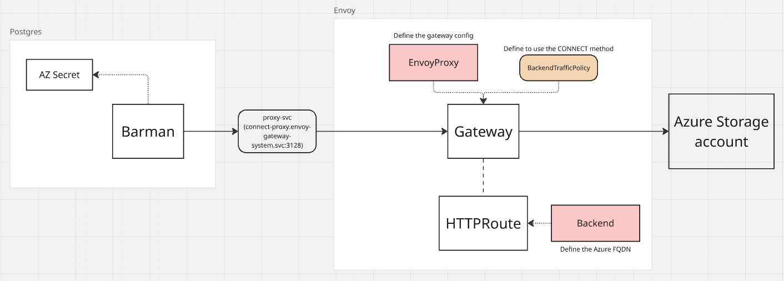

# ENVOY PoC

## ORIGINAL PROBLEM

- some pods need to connect to az blob storage private endpoint (e.g. for storing backups, etc.).
- we easily manage cilium netpols for resources inside the cluster
- we need external approval for cilium netpols that go outside of the cluster
- ingress and egress in the cluster and to outside the cluster is already managed by netpol (ACL not stricly needed?)
- okay to use unencrypted traffic between pod-proxy, as long the connection proxy-az is encrypted (anyway encrypted connection everywhere is better if doesn't add too much complexity)
- only some traffic have to go through the proxy (e.g. postgres->az redirected, harbor->az not redirected, but also postreas-master->postgres-replica doesn't have to go through the proxy)
- example of app that will need to use this: barman (cnpg managed postgres clusters), velero, various app that store data in az blob storage

## WHAT WE WANT

Set up an intermediary resource that works as proxy for connection pod-az blob storage to make it easier the definition of external netpols (proxy-az).
We define one time the external netpol (that needs further, external, approval), while we manage more precisely the internal netpol (podA-proxy traffic).

## NICE TO HAVE

- centralize and inject with envoy the azure secrets

## EVALUATED POSSIBILITIES

- CONNECT tunnel: Pod --HTTP CONNECT--> Proxy --TLS Tunnel--> Azure
    set the HTTPS_PROXY and NO_PROXY env var in container definition
- reverse proxy: Pod --HTTP/HTTPS--> Proxy (credentials injection) --HTTPS--> Azure
    point to the envoy proxy instead of the azure blob storage, envoy will substitute the endpoint and inject the credentials for azure

## Component map

- envoyproxy define the configuration of the gateway
- backendtrafficpolicy define the traffic config of the gateway (reference the gateway instance)
- httproute define the route (link the backend component to the gateway instance)
- backend define the destination component (azure blob fqdn)
- gateway define the proxy instance (reference envoyproxy) of type gatewayclass

## PoC

- run on minukube
- envoy gateway
- test with cnpg cluster and backup to az

### CONNECT tunnel - Envoy components
| Resource | Purpose |
|---|---|
| `EnvoyProxy` | ClusterIP service type |
| `Gateway` | HTTP listener on port 3128 |
| `HTTPRoute` | Routes all requests to `azure-blob-storage` Backend |
| `BackendTrafficPolicy` | Enables `httpUpgrade: CONNECT` with `connect.terminate: true` — Envoy terminates the CONNECT and tunnels raw TCP |
| `Backend` | External FQDN: `xxx.blob.core.windows.net:443` |

